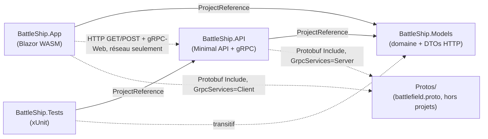
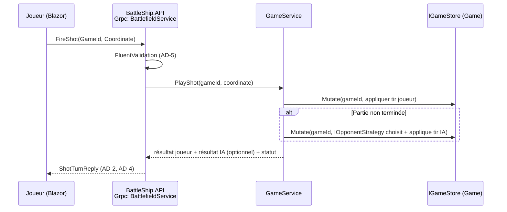

# Architecture Spine — Bataille Navale

## Design Paradigm

Architecture en couches à noyau de domaine isolé : le moteur de jeu et les contrats de données vivent dans un projet sans aucune dépendance externe (`BattleShip.Models`), que les couches transport et présentation ne font qu'adapter.

| Couche | Projet | Rôle |
| --- | --- | --- |
| Domaine | `BattleShip.Models` | Entités de jeu (Grid, Ship, Shot, Game), moteur (GameEngine), stratégies adverses, DTOs HTTP partagés — zéro dépendance |
| Application / Adaptateurs | `BattleShip.API` | Endpoints Minimal API, service gRPC, `GameService`, `IGameStore`, validateurs FluentValidation |
| Présentation | `BattleShip.App` | Composants Blazor WebAssembly, clients HTTP + gRPC-Web |
| Test | `BattleShip.Tests` | Tests unitaires (domaine) + tests d'intégration (`WebApplicationFactory`) |

## Invariants & Rules

### AD-1 — Placement du noyau de domaine

- **Binds:** CAP-1
- **Prevents:** Logique métier dupliquée ou couplée au transport dans `API`/`App`.
- **Rule:** Le moteur de jeu (`Grid`, `Ship`, `Shot`, `Game`, `GameEngine`, `IOpponentStrategy`) et les DTOs HTTP d'échange vivent tous dans `BattleShip.Models`. `BattleShip.Models` ne référence aucun package ASP.NET/gRPC/FluentValidation, uniquement le BCL. `[ADOPTED]` — déjà vrai dans le `.csproj` existant.

### AD-2 — Frontière de visibilité et véhicule des deux vues

- **Binds:** CAP-1, CAP-2, CAP-5, CAP-6
- **Prevents:** Fuite des positions de navires non découvertes ; deux implémentations qui inventent chacune leur forme de réponse.
- **Rule:** Les endpoints HTTP et le service gRPC ne sérialisent jamais l'entité domaine `Grid` brute. Un mapping dédié (`GameViewMapper`) est le seul point de conversion Domaine → DTO. Véhicule fixé : `GET /games/{id}` (HTTP) renvoie un **`GameStateDto`** composite unique portant `OwnGrid` (navires du joueur) + `OpponentGrid` (touché/raté/coulé uniquement) — pas deux endpoints séparés. La réponse gRPC `FireShot` (`ShotTurnReply`, voir AD-4) ne porte **pas** les grilles complètes, seulement les résultats du tour ; le client rappelle `GET /games/{id}` s'il a besoin de l'état complet. Un test vérifie qu'aucune coordonnée de navire non coulé n'apparaît dans `OpponentGrid`.

### AD-3 — Propriétaire, accès et concurrence de l'état

- **Binds:** CAP-1, CAP-2, CAP-3, CAP-6
- **Prevents:** Deux collections d'état distinctes qui divergent ; double application d'un tir ou lecture partielle (torn read) sous appels concurrents ; ambiguïté sur qui détient `IGameStore`.
- **Rule:** Une unique abstraction `IGameStore` (implémentation en mémoire, `ConcurrentDictionary<Guid, Game>`) est enregistrée en **Singleton**. `IGameStore` n'expose pas de Get/Set brut mais une méthode atomique `Mutate(Guid gameId, Action<Game> mutation)` qui synchronise l'accès à l'agrégat (verrou par partie). **`GameService`** (couche application) est le **seul** appelant autorisé de `IGameStore` ; les Endpoints HTTP et le service gRPC n'accèdent jamais directement à `IGameStore`, ils passent tous deux par `GameService`.

### AD-4 — Répartition des transports et contrat du tour de jeu

- **Binds:** CAP-2, CAP-6
- **Prevents:** Duplication de la logique/validation du tir sur deux transports parallèles ; ambiguïté sur comment/quand l'ordinateur joue son tour.
- **Rule:** Création et consultation de partie exposées en HTTP Minimal API (`POST /games`, `GET /games/{id}`). L'action de tir est exposée **exclusivement** via le service gRPC (`BattlefieldService.FireShot`), consommé en gRPC-Web depuis Blazor. `FireShot` résout en **une seule requête** le tir du joueur **puis**, si la partie n'est pas terminée, la riposte immédiate de l'ordinateur : `ShotTurnReply` porte les **deux** résultats (tir joueur, et tir ordinateur s'il a lieu) + le statut de partie (`InProgress`/`Won`/`Lost`). Aucun endpoint HTTP n'accepte de tir. Les deux transports délèguent uniquement à `GameService`.

### AD-5 — Emplacement de la validation

- **Binds:** CAP-7
- **Prevents:** Validation dispersée inline dans les lambdas d'endpoints ; domaine qui ferait confiance à une entrée non vérifiée.
- **Rule:** Les validateurs FluentValidation (`CreateGameRequestValidator`, `FireShotRequestValidator`) vivent dans `BattleShip.API` et s'exécutent avant tout appel à `GameService`, sur HTTP comme sur gRPC. Le domaine garde ses propres gardes (exceptions sur invariants violés), indépendamment de FluentValidation, pour rester sûr même appelé directement en test.

### AD-6 — Stratégie adverse

- **Binds:** CAP-4, CAP-12
- **Prevents:** Branchement de difficulté dispersé en `if/else` dans le moteur, ou moteurs dupliqués.
- **Rule:** Interface unique `IOpponentStrategy` avec deux implémentations, `EasyOpponentStrategy` (tir aléatoire) et `HardOpponentStrategy` (hunt & target, parité damier — voir `game-design.md`), sélectionnées par un paramètre `Difficulty` à la création de partie. Ajouter une difficulté = ajouter une implémentation, jamais modifier la boucle de jeu.

### AD-7 — Organisation des tests

- **Binds:** CAP-8
- **Prevents:** Création d'un 5ᵉ projet de test non prévu par le socle imposé ; ambiguïté sur où placer un nouveau test.
- **Rule:** `BattleShip.Tests` reste un projet unique avec deux dossiers : `Unit/` (règles pures du domaine, ne référence que `BattleShip.Models`) et `Integration/` (`WebApplicationFactory<Program>` contre `BattleShip.API`, HTTP et gRPC in-process).

### AD-8 — Frontière de référence projet

- **Binds:** CAP-2, CAP-5, CAP-6
- **Prevents:** Couplage de compilation accidentel qui casserait le build WASM ou ferait fuiter des dépendances serveur (FluentValidation, Grpc.AspNetCore) dans le bundle navigateur.
- **Rule:** `BattleShip.App` ne prend jamais de `ProjectReference` vers `BattleShip.API` (ni l'inverse) ; toute communication passe par le réseau (HTTP / gRPC-Web), les seuls types C# partagés viennent de `BattleShip.Models`. `[ADOPTED]` — déjà vrai dans les `.csproj` existants, fixé ici comme invariant durable.

### AD-9 — Source et partage du contrat gRPC

- **Binds:** CAP-2, CAP-6
- **Prevents:** Un type ambigu partagé entre les deux transports (ex. un POCO `FireShotRequest` dupliquant le message protobuf, sans relation définie).
- **Rule:** `battlefield.proto` vit dans un dossier `Protos/` à la **racine du dépôt**, hors des 4 projets, inclus par chemin relatif (`<Protobuf Include="../Protos/battlefield.proto" GrpcServices="Server"/>` côté API, `GrpcServices="Client"` côté App) — jamais via `ProjectReference` (étend AD-8). Les messages protobuf générés sont l'**unique** contrat de l'action tir ; les DTOs C# de `BattleShip.Models/Contracts` sont l'**unique** contrat HTTP. Aucun type n'est partagé entre les deux.

### AD-10 — Identité des camps

- **Binds:** CAP-1, CAP-10, CAP-11
- **Prevents:** Une notion d'identité joueur multi-utilisateur non justifiée par le périmètre (non-goal : pas de multijoueur), implémentée incompatiblement (ex. Guid généré côté client vs serveur).
- **Rule:** `enum Side { Human, Computer }` identifie l'auteur d'un tir (`Shot.Side`, historique CAP-10) et le camp dans les statistiques (CAP-11). Pas d'identité joueur individuelle. `GameId` (`Guid`) reste le seul identifiant du domaine.

### AD-11 — Mapping des codes d'erreur gRPC

- **Binds:** CAP-6, CAP-7
- **Prevents:** Le client Blazor interprète différemment la même erreur selon qui a implémenté le service gRPC.
- **Rule:** Coordonnée hors grille → `InvalidArgument`. Case déjà jouée → `FailedPrecondition`. `GameId` inconnu → `NotFound`. Tir après fin de partie → `FailedPrecondition`.





## Consistency Conventions

| Concern | Convention |
| --- | --- |
| Naming (entités, fichiers, interfaces) | Code en anglais, PascalCase/camelCase (C#) `[ADOPTED]` ; UI, README, ADR, PROMPTS.md, REVUE-IA.md en français |
| Coordonnées | `record Coordinate(int Row, int Col)` 0-indexé côté domaine, API et messages protobuf ; conversion en notation lettre+chiffre (A1..J10) uniquement à l'affichage Blazor |
| Identifiants | `GameId` en `Guid` (AD-10) ; camps identifiés par `enum Side { Human, Computer }`, pas d'identité joueur |
| Forme des erreurs | HTTP : `ValidationProblem` (RFC 7807) via `TypedResults` ; gRPC : `RpcException` avec mapping fixé en AD-11 |
| Mutation d'état | Toute mutation de `Game`/`Grid` passe par `IGameStore.Mutate(...)` via `GameService` (AD-3) ; propriétés à setter privé/interne, jamais d'accès direct aux collections internes depuis `API`/`App` |
| CORS | Une seule politique nommée dans `BattleShip.API`, limitée à l'origine de `BattleShip.App` |
| Logging | `ILogger<T>` injecté ; pas de `Console.WriteLine` dans `API`/`App` |

## Stack

| Name | Version |
| --- | --- |
| .NET SDK | 10.0 (LTS) `[ADOPTED]` |
| Microsoft.AspNetCore.OpenApi | 10.0.12 `[ADOPTED]` |
| Microsoft.AspNetCore.Components.WebAssembly(.DevServer) | 10.0.12 `[ADOPTED]` |
| FluentValidation | 12.1.1 (vérifié NuGet, revue independante confirmee) |
| Grpc.AspNetCore | 2.83.0 (vérifié NuGet, revue independante confirmee) |
| Grpc.AspNetCore.Web | 2.80.0 (vérifié NuGet ; ligne de release distincte de Grpc.AspNetCore, toutes deux courantes — pas une erreur) |
| Grpc.Net.Client | 2.83.0 (vérifié NuGet) |
| Grpc.Net.Client.Web | 2.80.0 (vérifié NuGet ; cf. note ci-dessus) |
| Grpc.Tools | 2.83.0 (vérifié NuGet) |
| Google.Protobuf | 3.36.1 (vérifié NuGet, revue independante confirmee) |
| xUnit | 2.9.3 `[ADOPTED]` — en maintenance ; xUnit v3 (4.0.1) est la ligne recommandée 2026, migration volontairement différée (voir Deferred) |
| Microsoft.NET.Test.Sdk | 17.14.1 `[ADOPTED]` |
| coverlet.collector | 6.0.4 `[ADOPTED]` |

## Structural Seed

```text
Protos/
  battlefield.proto           # message contract, partage sans ProjectReference (AD-9)

BattleShip.Models/
  Domain/
    Grid.cs                # grille 10x10, occupation des cases
    Ship.cs                # navire (taille, orientation, cases touchées)
    Shot.cs                 # tir joué (Coordinate, Side, résultat)  (AD-10)
    Game.cs                 # agrégat racine, applique les tirs, détecte la fin
    GameEngine.cs            # placement aléatoire de flotte, résolution de tir
    Opponent/
      IOpponentStrategy.cs
      EasyOpponentStrategy.cs
      HardOpponentStrategy.cs
  Contracts/
    CreateGameRequest.cs
    GameStateDto.cs          # OwnGrid + OpponentGrid  (AD-2)

BattleShip.API/
  Program.cs                  # DI: IGameStore (Singleton), GameService, validateurs, CORS, gRPC, OpenAPI
  Endpoints/
    GameEndpoints.cs          # POST /games, GET /games/{id}  (AD-4)
  Grpc/
    BattlefieldGrpcService.cs   # FireShot -> GameService.PlayShot  (AD-4, AD-9, AD-11)
  Services/
    GameService.cs             # seul appelant de IGameStore  (AD-3)
  Validation/
    CreateGameRequestValidator.cs
    FireShotRequestValidator.cs  # valide le message protobuf FireShotRequest
  State/
    IGameStore.cs
    InMemoryGameStore.cs       # ConcurrentDictionary<Guid, Game> + Mutate() atomique  (AD-3)
  Mapping/
    GameViewMapper.cs          # (AD-2)

BattleShip.App/
  Pages/
    NewGame.razor              # création de partie + choix difficulté (CAP-12)
    Play.razor                  # grilles, tir, historique (CAP-5, CAP-10)
    Summary.razor                # statistiques de fin de partie (CAP-11)
  Services/
    GameHttpClient.cs           # appelle POST/GET /games
    ShotGrpcClient.cs           # appelle BattlefieldService.FireShot

BattleShip.Tests/
  Unit/                        # domaine pur, référence Models uniquement  (AD-7)
  Integration/                 # WebApplicationFactory<Program>, HTTP + gRPC  (AD-7)
```

## Capability → Architecture Map

| Capability | Lives in | Governed by |
| --- | --- | --- |
| CAP-1 (moteur de jeu) | `BattleShip.Models/Domain` | AD-1, AD-10 |
| CAP-2 (contrat API) | `BattleShip.API/Endpoints`, `Mapping` | AD-2, AD-4, AD-8, AD-9 |
| CAP-3 (boucle de jeu) | `BattleShip.Models/Domain/Game.cs`, `BattleShip.API/Services/GameService.cs` | AD-1, AD-3, AD-4 |
| CAP-4 (adversaire) | `BattleShip.Models/Domain/Opponent` | AD-6 |
| CAP-5 (interface Blazor) | `BattleShip.App` | AD-2, AD-8 |
| CAP-6 (gRPC) | `BattleShip.API/Grpc`, `Protos/` | AD-2, AD-3, AD-4, AD-9, AD-11 |
| CAP-7 (validation) | `BattleShip.API/Validation` | AD-5, AD-11 |
| CAP-8 (tests) | `BattleShip.Tests` | AD-7 |
| CAP-9 (livrables IA) | `PROMPTS.md`, `docs/adr/`, `REVUE-IA.md` (racine du dépôt) | — hors architecture logicielle, processus documentaire |
| CAP-10 (historique) | `BattleShip.Models/Domain/Game.cs` (liste de `Shot`), `BattleShip.App/Pages/Play.razor` | AD-1, AD-2, AD-10 |
| CAP-11 (statistiques) | `BattleShip.Models` (calcul par `Side`), `BattleShip.App/Pages/Summary.razor` | AD-1, AD-10 |
| CAP-12 (difficulté) | `BattleShip.Models/Domain/Opponent` | AD-6 |

## Deferred

- **Détail exact des champs du message `.proto`** (`FireShotRequest`/`ShotTurnReply`) : laissé à l'implémentation de CAP-6 ; AD-4/AD-9/AD-11 fixent l'action, le round-trip et les codes d'erreur, pas chaque champ.
- **Détail des composants Blazor** (découpage exact des `.razor`, gestion d'état côté client) : seule la frontière réseau (AD-8) et la frontière de visibilité (AD-2) sont fixées.
- **Représentation exacte de `Coordinate` sur le fil** (entiers vs notation A1) au-delà de la convention déjà fixée : détail d'implémentation, pas un risque de divergence entre unités.
- **Champs exacts des DTO de statistiques** (CAP-11) au-delà de "par `Side`" : implémentation.
- **Migration xUnit v2 → v3** : xUnit 2.9.3 reste en maintenance, suffisant pour la durée du TP ; à réévaluer seulement si un problème de compatibilité apparaît en cours d'implémentation.
- **Format exact des ADR/PROMPTS/REVUE-IA** (CAP-9) : processus documentaire, pas un invariant d'architecture logicielle.
- **Environnement de déploiement/hébergement** : hors périmètre (non-goal du spec), démonstration en local uniquement.
- **Découpage en epics/stories** : laissé à `bmad-create-epics-and-stories`, qui doit respecter la Capability → Architecture Map ci-dessus.
